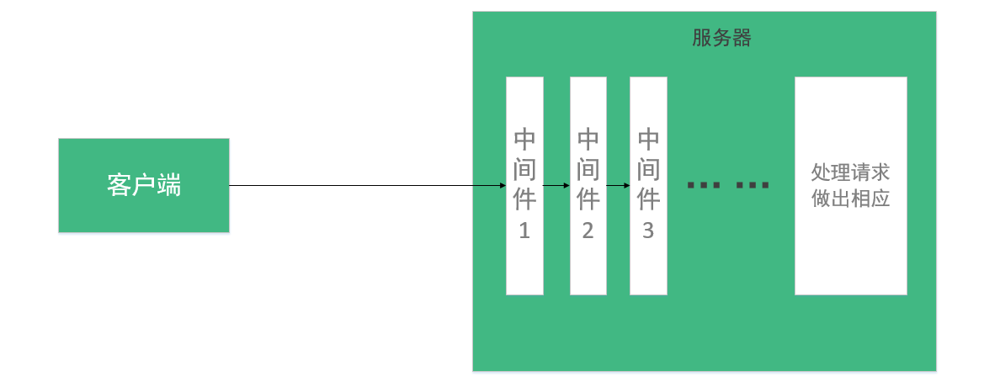

# express-demo
Express的学习记录

## express是什么？

基于 `Node.js` 平台，快速、开放、极简的 `web` 开发框架。

## 创建一个服务器

回顾一下原生`http`的创建服务器的方式：

```js
var http = require('http')
var server = http.createServer(function (req, res) {
	console.log('Hello Server')
})
server.listen(9000)
```

再来看看`express`如果如何快速创建一个服务器：

```js
var http = require('http')
var express = require('express')
var app = express()

http.createServer(app)

app.get('/', function (req, res) {
	console.log('Hello Server')
})

app.listen(9000)
```

这两种方式，当我们在浏览器回车敲下`http://localhost:9000`的时候，我们都能在控制台看到打印出`Hello Server`

综上可见，`app`实际上就是一个匿名函数。只不过，`app`更为强大，比如接下来要说的路由。

## 路由

之前我们都是直接访问根域名，`express`为我们提供了路由，可以为我们更快捷开发复杂的`web`应用提供了便利：

```js
app.get('/api', function (req, res) {
	res.send('Hello Server');
	res.end();
})

app.listen(9000)
```

接下来，我们就可以访问`http://localhost:9000/api`了。

## 中间件

这是一张我对中间件理解的图：



我们可以把中间件理解为一个对用户请求进行过滤和预处理的东西，它一般不会直接对客户端进行响应，而是将处理之后的结果传递下去。其实它就是相当于一个过滤器，类似于`javeEE`中的`filter`。

`express`的中间件具有以下特征：

1. 可拔插
2. 谁先加载谁先执行
3. 大多数情况下，每个中间件相对来说都是独立的

对于第三点，我们可以举一个例子：	`cookie` 和 `cookieSession` 这两个中间件的顺序必须是`cookie`在前。

## express的中间件

这里不得不提及`express`的创始人—— [tj](https://github.com/themejuice/tj), 这位我一直认为是对`Node.js`的发展影响最大的大佬之一。同时也是`Koa`、`Stylus`、`Pug`、`Mocha`、`Connect`等的作者。

最早，`tj`只是推出了`Connect`这个包含了丰富的中间件的项目，后来，就有依赖于`Connect`的`express`。直到最新的4.0版本，`express`完全摆脱了`Connect`的依赖，而仅仅保留了`express.static`这一个内置中间件。

而以前内置的中间件现在已经全部单独作为模块安装使用了。请参考 [中间件列表](https://github.com/senchalabs/connect#middleware)。

## express.static

作为目前唯一内置的中间件，我们不得不首先熟知。

`express.static` 是一个基于 `serve-static` 用于托管静态资源的中间件。 （注：`Cinwell`的`docsify`的脚手架似乎也是这个？）


- `express.static(root, [options])`
- root: 指定提供静态资源的根目录。
- options: 这里先行省略，请参见 [options](http://www.expressjs.com.cn/guide/using-middleware.html#middleware.built-in)

例如，我们当前的目录结构如下：

```html
├─public
│  └─index.html
└─app.js
```

`public`是一个用来存放静态资源的目录，我们如果仅仅开启一个监听某某端口的服务，直接来访问`index.html`肯定是不行的。借助`express.static`，我们可以通过这样写，快速地将静态资源得到托管：

```js
app.use('/', express.static(__dirname + '/public'))
```
然后我们就能这样访问我们的静态资源了：

```
http://localhost:9000/index.html
```

## 自定义中间件


